# SmartBarberApp ✂️

<p align="center">
  
  
  
  
</p>

<p align="center">
  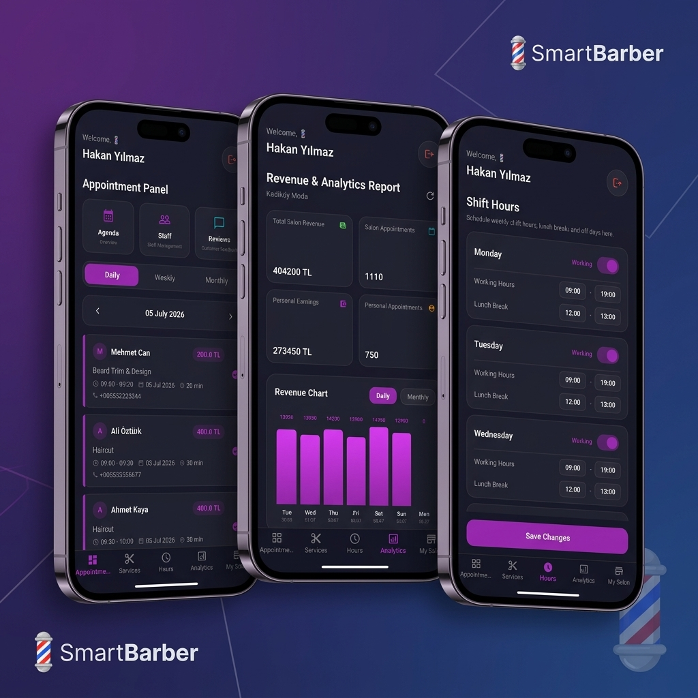
</p>

SmartBarberApp is a salon appointment and management platform that allows customers to book appointments while helping salon owners manage staff, schedules, and daily business operations.

---

## Table of Contents

- [Overview](#overview)
- [Why SmartBarberApp?](#why-smartbarberapp)
- [Features](#features)
- [Architecture](#architecture)
- [Screenshots](#screenshots)
- [Project Structure](#project-structure)
- [Technology Stack](#technology-stack)
- [Installation](#installation)
- [Configuration](#configuration)
- [Authentication Flow](#authentication-flow)
- [Booking Flow](#booking-flow)
- [API Endpoints](#api-endpoints)
- [Database Schema](#database-schema)
- [Security](#security)
- [Testing](#testing)
- [Performance](#performance)
- [Deployment](#deployment)
- [Future Improvements](#future-improvements)
- [Contributing](#contributing)
- [License](#license)
- [Author](#author)

---

## Overview

SmartBarberApp bridges the gap between local salon owners and their clients. The platform consists of a cross-platform mobile application (built with Flutter) and a robust backend Web API (built with ASP.NET Core). It replaces traditional paper-based salon scheduling with automated slot allocation, revenue charts, and stylist shift planning.

---

## Why SmartBarberApp?

### The Real-World Problem
For customers, scheduling a simple hair or beard appointment often involves phone calls, busy lines, or waiting in queues at local shops. For salon owners, managing daily bookings, employee shift rotations, and tracking commission splits is a manual, error-prone task recorded in paper notebooks.

### Inefficiencies of Traditional Management
* **Double-Bookings & Gaps:** Hand-written slots often lead to overlapping appointments or unproductive gaps during a stylist's day.
* **No-Show Revenue Loss:** Customers missing scheduled times cause direct financial loss, as traditional systems lack automated booking alerts or confirmation reminders.
* **Lack of Analytics:** Salon owners cannot easily view total earnings, calculate commissions, or understand which services yield the most profit without tedious calculator work at the end of the month.

### The SmartBarberApp Solution
SmartBarberApp digitizes the entire lifecycle. Customers enjoy a seamless visual slot-selection flow, while barbers get an automated dashboard that updates daily schedules, manages staff shifts, and crunches monthly revenue charts automatically.

---

## Features

### 💈 For Barbers & Salon Owners
* **Interactive Agenda:** Track daily, weekly, or monthly bookings in a clear agenda column grid.
* **Employee Shift Manager:** Adjust shift hours, configure lunch breaks, and toggle working/active statuses.
* **Business Analytics:** Real-time metrics on total salon revenue, individual stylist earnings, total bookings, and popular service distributions.
* **Reviews and Feedback Panel:** Review customer feedback, ratings, and comments.
* **Staff Controls:** Manage titles, service specializations, and toggle active working status.

### 👤 For Customers
* **Salon Discovery:** Search for nearby salons and view details like ratings, distance, and working status.
* **Streamlined Booking:** Select services, pick a specialized stylist, and choose an available date and time slot.
* **Manage Appointments:** Review, cancel, or reschedule upcoming bookings.

---

## Architecture

SmartBarberApp uses a decoupled architecture where the Flutter mobile client communicates with the ASP.NET Core Web API over secure HTTP REST protocols. The backend is structured using clean layer isolation:

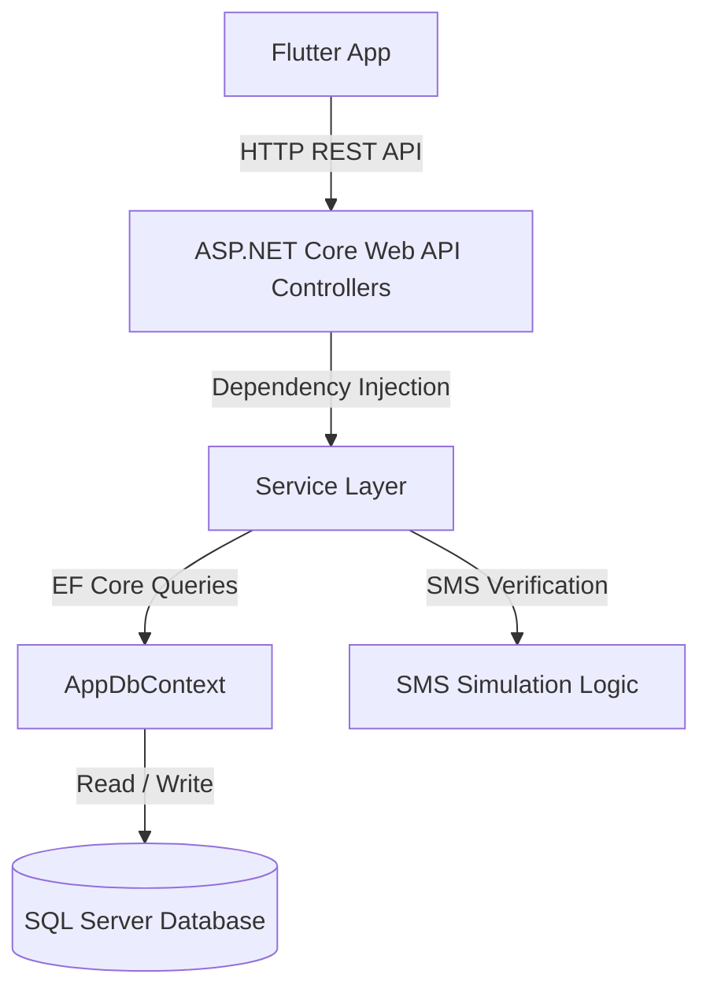

### Architectural Components
* **Flutter Mobile App:** Handles UI presentation, local state, mapping visualizations, and routes API requests.
* **ASP.NET Core Web API:** Receives HTTP requests, executes request-validation middleware, and manages dependency injection.
* **Business Logic Layer (Services):** Coordinates appointment availability, handles SMS OTP generation, calculates salon analytics, and performs verification checks.
* **Entity Framework Core (EF Core):** Serves as the Object-Relational Mapper (ORM), translating C# LINQ queries into optimized SQL.
* **SQL Server Database:** A reliable relational database storing customer and stylist profiles, transaction logs, shifts, and reviews.

### Request-Response Lifecycle
1. The Flutter client fires an HTTP `POST /api/appointments` request containing the chosen service, stylist, date, and time, passing the JWT authorization token in the headers.
2. The Web API's JWT authorization middleware intercepts and validates the token. If valid, it binds the user claims and routes the request to `AppointmentsController`.
3. The controller delegates validation to `BookingService`, which queries `AppDbContext` to check if the stylist has an active shift and is not double-booked.
4. If valid, the service creates the booking record, updates the database via EF Core, and returns a success payload.
5. The API controller formats the response into JSON and returns an `HTTP 200 OK` status back to the Flutter client.

---

## Screenshots

### 💈 Barber / Salon Owner Interface
A comprehensive set of tools for managing stylists, shift hours, daily calendar appointments, and financial reports.

| Agenda / Calendar | Shift Working Hours | Revenue & Analytics | Stylists & Service Stats | Salon Settings Profile |
| :---: | :---: | :---: | :---: | :---: |
| 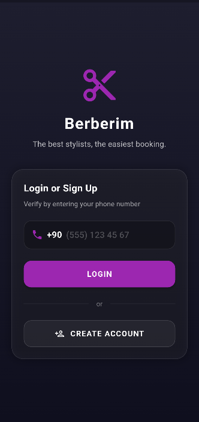 | 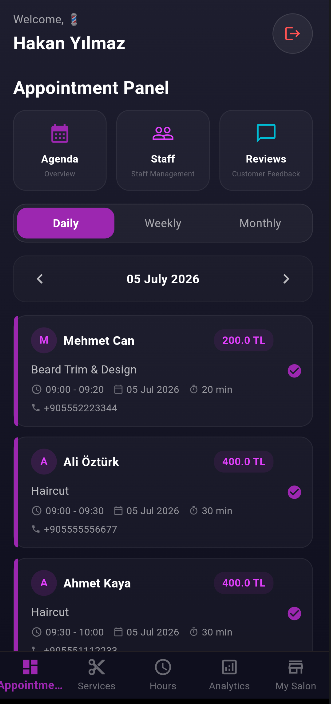 | 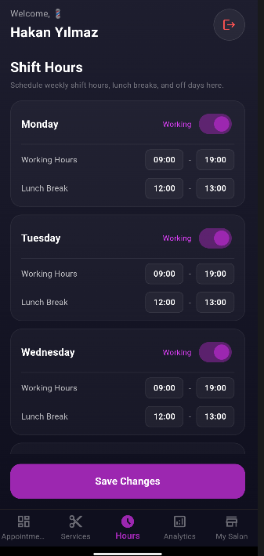 | 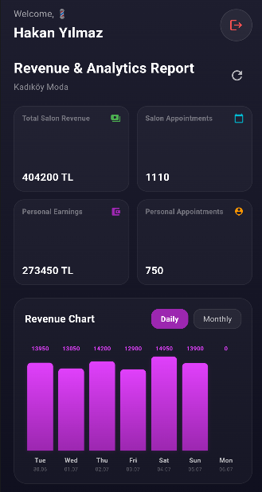 | 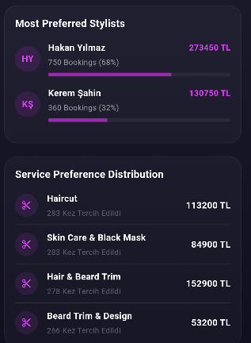 |

<br/>

### 👤 Customer Booking Interface
An intuitive client-side interface to discover salons, read stylist reviews, select date & time, and track bookings.

| Explore Feed | Select Service | Select Date & Time | Booking Success | My Appointments | Customer Reviews |
| :---: | :---: | :---: | :---: | :---: | :---: |
| 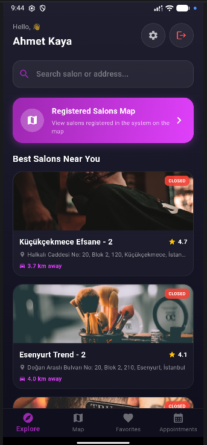 | 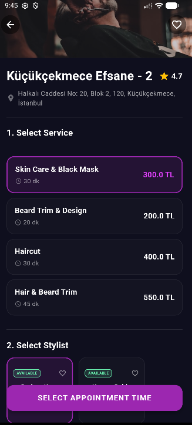 | 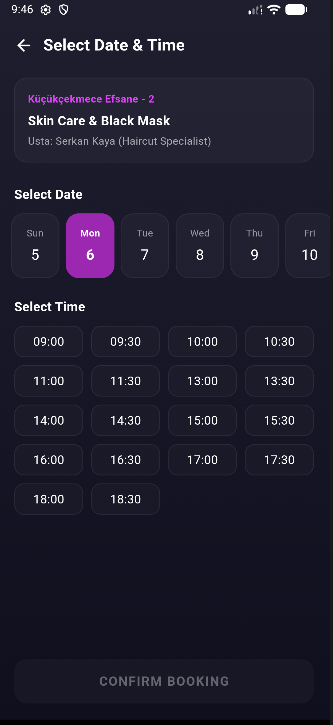 | 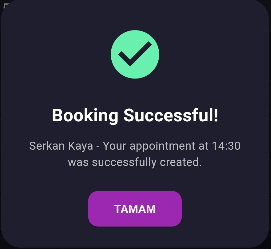 | 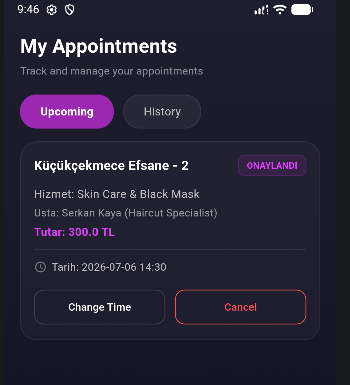 | 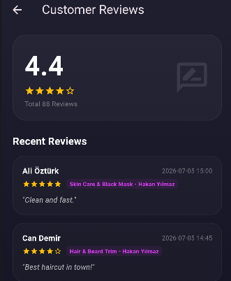 |

---

## Project Structure

```text
SmartBarberApp/
├── backend/
│   ├── BerberSalonu.Tests/          # xUnit Unit tests for backend controller validation
│   └── BerberSalonu.WebApi/         # ASP.NET Core Web API Project
│       ├── Controllers/             # REST Endpoints handling incoming HTTP requests
│       ├── Data/                    # AppDbContext, Seed Data, and EF Migrations
│       ├── Models/                  # Relational DB Models (User, Salon, Appointment)
│       ├── Services/                # Core business services (AuthService, SmsService)
│       └── Properties/              # Launch Profiles and server configurations
├── docs/
│   └── images/                      # App screenshots and mockup banners
└── frontend/
    └── lib/                         # Flutter App Source Code
        ├── main.dart                # App Entry Point & global routing configurations
        ├── screens/                 # UI Screen files grouped by feature sets
        │   ├── barber/              # Barber Dashboard, Calendar, and Analytics views
        │   └── customer/            # Customer Home, Booking, Map, and settings views
        └── services/                # REST connection services matching API endpoints
```

### Folder Responsibilities
* **Controllers:** Expose API routes and handle request validation, model binding, and HTTP status codes response mapping.
* **Data:** Defines database configurations, triggers seeding with realistic mock financial data, and communicates with SQL Server.
* **Models:** Represents database tables as C# objects and defines validation attributes.
* **Services:** Separates business logic (SMS generation, analytics queries) from controllers to preserve Clean Architecture guidelines.
* **Flutter Screens:** Houses stateful/stateless widgets representing the user interfaces for customers and salon workers.

---

## Technology Stack

* **Flutter:** Cross-platform SDK utilized to compile native mobile applications for Android and iOS using a single Dart codebase.
* **Dart:** An object-oriented, class-based language optimizing client-side performance and rendering smooth, responsive UIs.
* **ASP.NET Core:** High-performance, open-source backend framework optimized for building cloud-connected RESTful APIs.
* **Entity Framework Core:** Object-relational mapping (ORM) library allowing developers to query database tables using standard LINQ expressions instead of writing raw SQL strings.
* **MS SQL Server:** Enterprise-grade relational database management system used to persist transactional records and profiles safely.
* **JWT (JSON Web Tokens):** Token standard used to authenticate users and securely transmit claims between client and server.
* **REST API:** Standardized interface design mapping HTTP methods (GET, POST, PUT, DELETE) to backend controller routes.
* **OpenStreetMap & Leaflet:** Mapping API used for geolocation, search, and map display without high licensing fees.
* **Dotenv (.env):** Library used to manage configuration files and inject environment secrets into the backend process runtime.

---

## Installation

### Prerequisites
* **.NET SDK:** Version 10.0 (or newer)
* **Flutter SDK:** Version 3.24.0 (or newer)
* **SQL Server:** LocalDB or Express instance running on port 1433

### 🔧 1. Backend Setup

1. Open the WebAPI directory:
   ```bash
   cd backend/BerberSalonu.WebApi
   ```
2. Build the project and restore packages:
   ```bash
   dotnet build
   ```
3. Run database migrations to construct tables:
   ```bash
   dotnet ef database update
   ```
4. Start the backend service:
   ```bash
   dotnet run --launch-profile http
   ```

### 📱 2. Frontend Setup

1. Open the frontend directory:
   ```bash
   cd frontend
   ```
2. Install dependencies:
   ```bash
   flutter pub get
   ```
3. Run the application on an emulator or active device:
   ```bash
   flutter run
   ```

---

## Configuration

Sensitive connection strings and credentials must be configured inside a `.env` file placed at the root of `backend/BerberSalonu.WebApi`. Copy the template below:

```env
CONNECTION_STRING=Server=localhost;Database=BerberSalonuDb;Trusted_Connection=True;TrustServerCertificate=True;MultipleActiveResultSets=true
JWT_SECRET=YourSuperSecureLongKeyThatIsAtLeast32BytesInLength12345!
TWILIO_USE_MOCK_SMS=true
```

*Note: With `TWILIO_USE_MOCK_SMS=true` enabled, the verification SMS code is generated inside the API backend and printed directly to your console, allowing offline testing without external service integrations.*

---

## Authentication Flow

SmartBarberApp uses a passwordless phone authentication flow verified with short-lived OTP tokens.

1. **Request Verification:** The user inputs their phone number. The client issues a `POST /api/auth/send-otp` request.
2. **OTP Generation:** The API service generates a 6-digit random code, associates it with the phone number, saves it temporarily in the database with an expiration timestamp, and writes it to the server console log.
3. **Submission:** The user inputs the received 6-digit code. The client issues a `POST /api/auth/verify-otp` request.
4. **JWT Handshake:** The server checks the verification code. If valid and not expired, it issues a signed JWT containing the user's ID, role, and username.
5. **Authorization:** The client saves this token securely. Every subsequent request adds the token to the HTTP request headers:
   `Authorization: Bearer <JWT_TOKEN>`.

---

## Booking Flow

Customers navigate a structured booking flow to prevent double-bookings:

1. **Discover:** Customers browse nearby salons on an interactive map or a list feed.
2. **Services selection:** Customers select one or more services from the salon's list.
3. **Stylist Selection:** The customer chooses an employee. The app displays only the chosen stylist's working hours.
4. **Select Date & Time:** The app queries `/api/appointments/available-slots` to retrieve empty slots, removing occupied blocks or lunch breaks.
5. **Confirmation:** The customer clicks "Book Now". The backend registers the time slot, saves the appointment details, and updates the database context.

---

## API Endpoints

### Endpoint Matrix
| Endpoint | Method | Auth | Description |
| :--- | :---: | :---: | :--- |
| `/api/auth/send-otp` | `POST` | Public | Generate and display an OTP verification code |
| `/api/auth/verify-otp` | `POST` | Public | Verify OTP code and return JWT access token |
| `/api/salons` | `GET` | User | List salons with distance calculations |
| `/api/barber/employees` | `GET` | User/Barber | Fetch stylists registered in the salon |
| `/api/appointments` | `POST` | User | Confirm and register a new booking slot |
| `/api/barber/analytics` | `GET` | Barber | Fetch monthly revenue and employee stats |

---

## Database Schema

SmartBarberApp utilizes a structured relational schema to enforce referential integrity across users and bookings.

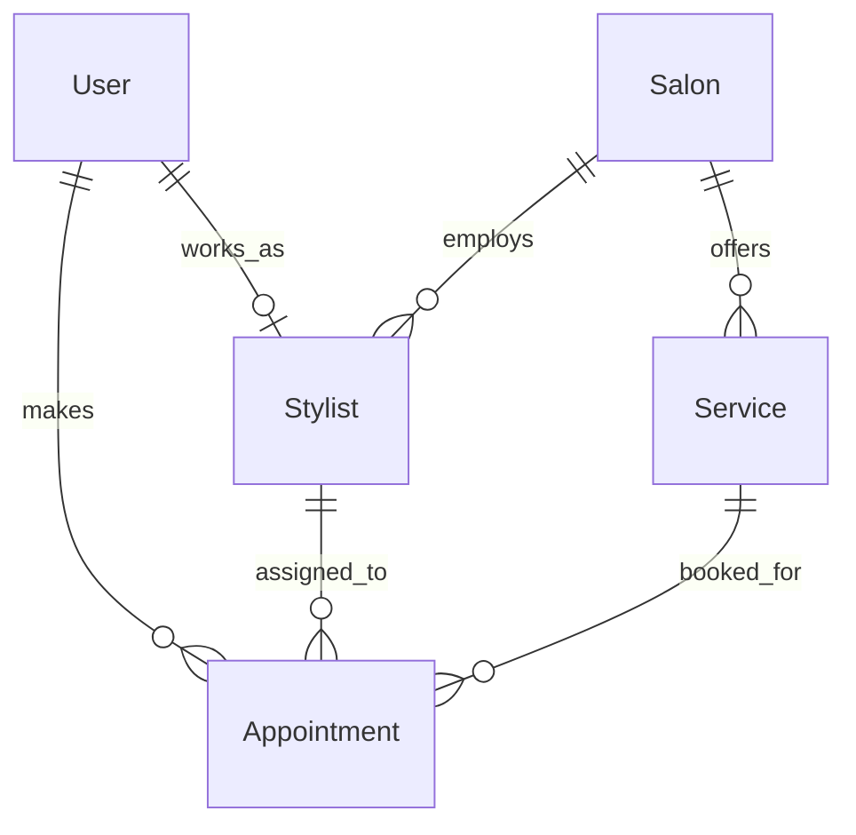

### Entity Model Definitions
* **Users:** Stores account profiles, roles (Customer, Barber, Admin), and registration timestamps.
* **Salons:** Holds location data (lat/lng coordinates), shop names, and addresses.
* **Stylists (Employees):** Maps a User record to a Salon. Stores their specialization, active working hours, availability, and reviews rating.
* **Services:** Lists available care treatments, their cost, and duration.
* **Appointments:** Links a customer, stylist, and service to a reserved slot.
* **Reviews:** Links customer feedback and rating metrics to a stylist and service.

---

## Security

* **JWT Verification:** Encrypts user credentials inside tokens. All secure endpoints require the access token passed in authorization headers.
* **Role-Based Authorization:** Middlewares restrict endpoints based on user roles (e.g., only authenticated accounts with the `Barber` role can call analytics endpoints).
* **Environment Variables:** All connection strings and server configurations are isolated inside local `.env` files to prevent exposure.
* **Sensitive Data Protection:** Database connections are loaded dynamically from environment files.
* **Secure API Communication:** Designed to communicate over HTTPS, preventing packet-sniffing or man-in-the-middle attacks.
* **Git Ignore Strategy:** `.gitignore` rules prevent staging credentials files (`.env`, `appsettings.json`, and local database files like `.mdf`).

---

## Testing

### Unit Tests
The backend contains automated tests (built with xUnit) validating core booking validations.
* To run backend unit tests:
  ```bash
  cd backend/BerberSalonu.Tests
  dotnet test
  ```

### API Testing
A Swagger documentation sandbox is available. Run the Web API in development mode and open `http://localhost:5123/swagger` in your browser to inspect and test routes.

### Manual Verification
* Verified appointment creations, rescheduling operations, and shift edits on real Android emulators running Flutter debug builds.
* Tested database concurrency checks under mock workloads.

---

## Performance

* **Non-Tracking Database Queries:** Uses `.AsNoTracking()` in EF Core queries that do not modify entities, reducing memory overhead.
* **Asynchronous Controllers:** Utilizes `async/await` patterns throughout the REST services to prevent thread starvation under heavy request loads.
* **Eager Loading Optimization:** Avoids N+1 query problems by using `.Include()` exclusively for necessary relationships.
* **Optimized Flutter Rendering:** Utilizes `const` constructors, lazy-loaded list views, and explicit layout constraints to run at 60 FPS on mobile devices.

---

## Deployment

### SQL Database
* Configurable with Azure SQL Database, AWS RDS for SQL Server, or self-hosted SQL Server instances.

### Mobile Client
* **Android:** Compiles into release App Bundles (`.aab`) or APKs (`.apk`) using `flutter build appbundle`.
* **iOS:** Prepares archive files (`.ipa`) uploadable to Apple TestFlight and App Store Connect using `flutter build ipa`.

---

## Future Improvements

* **Production SMS Gateway API:** Replace local mock random SMS generation with an external SMS gateway API integration (such as Netgsm or other domestic carriers) to send real verification messages.
* **AI Appointment Predictions:** Build regression models to predict peak hours for salons.
* **Smart Stylist Recommendations:** Suggest stylists based on historical ratings and customer selections.
* **Push Notifications:** Configure push notifications for real-time booking alerts and reminders.

---

## Contributing

Contributions are welcome! If you find bugs, have feature requests, or want to contribute to the codebase:
1. Fork the repository.
2. Create a feature branch (`git checkout -b feature/NewFeature`).
3. Commit your changes (`git commit -m 'Add NewFeature'`).
4. Push to the branch (`git push origin feature/NewFeature`).
5. Open a Pull Request.

---

## License

This project is licensed under the MIT License - see the [LICENSE](LICENSE) file for details.

---

## Author

**samet sagir**
* Email: sametsagir6969@gmail.com
